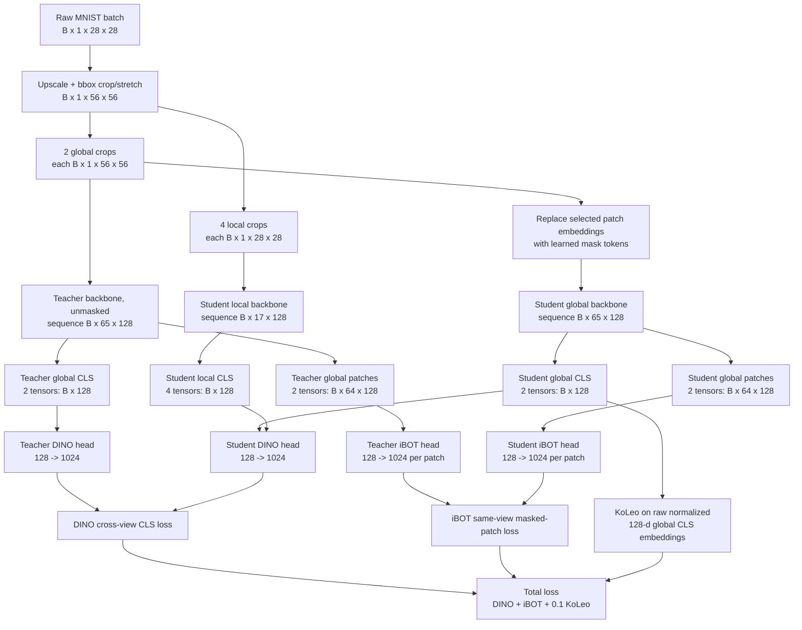

# Grasp-based embeddings

## Goal - The only experimental project in the current track.

### Version 1 - 
- [x] Beat **99.5% test accuracy on MNIST** using representations learned without label supervision (and if possible in a sample efficient way).
- [Replication guide for the 99.50% MNIST triplet I-JEPA ensemble](docs/replicate_9950_triplet_ensemble.md).

### Version 2 -
- [ ] Try DinoV2 (with ensemble tricks).
- [ ] Run a DINOv2 ablation with non-crop augmentations disabled: retain the
  global/local crop fan-out and iBOT masking, but remove brightness/contrast
  jitter, Gaussian blur, and solarization.
- [ ] Try SimCLR.
- [ ] Try ConvNext.
- [x] Try XGBoosting and Random Forests on IJEPA.
- [ ] Check if RL and evolutionary programs can be used to learn Visual strategy (Try program synthesis based on IJEPA patch sampling and distance comparison). See notes about VJEPA actions below.

### Version 3 -
- [ ] Run an experiment with Decision tree + Neural net hybrids.
- [ ] Try using point tracking as a supervision signal to learn good features.
- [ ] Try using VJEPA actions to develop sampling strategy.

## What I wish to test.
1. Learning Patch embeddings.
   1. [x] Train a classifier with brief.
   2. [x] Test shape descriptors on MNIST and measure similarity / classification accuracy.
   3. [x] Train a VIT/MAE on MNIST and measure similarity. 
   4. [x] Train a VIT/MAE on MNIST and measure classification accuracy after finetuning.
   5. [x] Train a Conv-net MAE on MNIST and measure similarity. 
   6. [x] Train a Conv-net MAE on MNIST and measure classification accuracy after finetuning.
   7. [x] Test KNN with ConvNet and VIT.
   8. [x] Train an I-JEPA on MNIST and measure similarity. 
   9.  [x] Train an I-JEPA on MNIST and measure classification accuracy (maybe after finetuning?).
   10. [x] Test KNN with I-JEPA.
   11. [x] Test KNN with handcrafted BRIEF (random sampling).
   12. [x] Test KNN with *structured* (designed) BRIEF sampling.
2. Looks like I am going to have to double down on IJEPA.
   1. [x] Run a test using cropped and scaled images — bbox-crop + stretch-to-frame is a large win at 50 ep; see finding 10.
   2. [x] Run a test using a different patching scheme (Closer to canonical IJEPA) — canonical block masking underperforms scatter masking at this resolution; see finding 9.
   3. [x] Tried increased embedding dims — didn't help.
   4. [x] Try a **Conv-net stem** (replace the linear patch embedding with a small conv front-end) — old stem `Conv3 s2 p1 -> Conv2 s2 p1` underperformed custom 10-6 I-JEPA; see finding 16.
   5. [x] Re-run the bbox-preproc scatter JEPA at **500 ep** (run past the planned 300; flatten only, per request) — see finding 11: the preproc edge **holds** (flatten probe 99.15%, flatten 5-NN 99.01% — new bests) but is mostly *front-loading*; raw scatter nearly matches the probe at full budget.
   6. [ ] Account for known MNIST **label errors** when reading these results — the test set has ~15 human-validated mislabels (~0.15%), a soft ~99.8% ceiling that several frozen probes are now brushing against. See the corrected-test-set viewer / indices: [labelerrors.com](https://labelerrors.com) ([Northcutt et al., NeurIPS 2021](https://arxiv.org/pdf/2103.14749); [cleanlab/label-errors](https://github.com/cleanlab/label-errors)).
3. Additional material follow up -
   1. [ ] [Le-JEPA](https://arxiv.org/pdf/2511.08544)
   2. [ ] [V-JEPA with action condition](https://arxiv.org/pdf/2601.14354) - See ways to sample trajectories.
   3. [ ] Explore [ConvNeXt](https://arxiv.org/pdf/2201.03545) — modern pure-ConvNet; its patchify conv stem is the natural front-end for the conv-stem idea (item 2.7).
   4. [ ] Check out [LeWorldModel](https://arxiv.org/abs/2603.19312)
   5. [ ] Trace the lineage of the above ideas.

## DINOv2

Paper: [DINOv2: Learning Robust Visual Features without Supervision](https://arxiv.org/pdf/2304.07193).
Implementation: [`dino-trials/`](dino-trials/README.md).

DINOv2 is the Version 2 self-distillation track: learn augmentation-invariant
global features with the DINO class-token objective, retain spatial information
with the iBOT masked-patch objective, and prevent global representation collapse
with KoLeo. The implementation is built from PyTorch primitives rather than an
external DINO/iBOT package.

### Current MNIST configuration

- **Input preprocessing (default):** raw `1x28x28` MNIST -> upscale to `1x56x56`
  -> tight nonzero bounding-box crop -> stretch back to `1x56x56`. This matches
  the geometry normalization that materially improved the custom I-JEPA runs.
- **Views per image:** two `1x56x56` global crops and four `1x28x28` local
  crops. The teacher receives the two unmasked global crops. The student
  receives masked versions of those global crops plus all four unmasked local
  crops. Views are resampled whenever an image is loaded.
- **Patches:** non-overlapping `7x7` patches. A global crop gives an `8x8 = 64`
  patch grid; a local crop gives a `4x4 = 16` patch grid.
- **Backbone:** embedding width 128, four Transformer blocks, four attention
  heads (32 dimensions per head), SwiGLU hidden width 344, LayerScale, and
  stochastic depth.
- **Projection heads:** independent DINO CLS and iBOT patch heads, each
  `128 -> 512 -> 512 -> 128 -> 1024 prototypes`. Student and teacher have
  separate copies of both heads; each teacher head is the EMA of its matching
  student head.
- **Student size:** 1,865,024 trainable parameters. Teacher parameters receive
  no gradients and follow the student by EMA.

### End-to-end tensor and loss flow



The patch embedding convolution has kernel and stride 7. After adding the CLS
token and learned positional embeddings, the Transformer preserves the final
dimension:

| view | image tensor | patch output | + CLS Transformer sequence | final outputs |
|---|---|---|---|---|
| one global crop | `B x 1 x 56 x 56` | `B x 64 x 128` | `B x 65 x 128` | CLS `B x 128`; patches `B x 64 x 128` |
| one local crop | `B x 1 x 28 x 28` | `B x 16 x 128` | `B x 17 x 128` | CLS `B x 128`; patches `B x 16 x 128` |

A mask token is a learned 128-dimensional vector, not a black image patch. At a
masked global position `i`, the student replaces the pixel-derived embedding
while retaining position:

```text
patch_embedding_i + position_i  ->  mask_token + position_i
```

The teacher sees the same global crop without this replacement. Local crops are
not masked.

### Simplified objectives

Use `T1`, `T2` for the teacher's two global views; `Sg1`, `Sg2` for the
student's two global views; and `Sl1` through `Sl4` for the student local views.
`H(T, S)` is cross-entropy between teacher and student distributions over the
relevant head's 1,024 prototypes.

The DINO image loss uses projected CLS tokens. It compares each teacher global
view with the other student global view and every student local view—never the
identical global view:

```text
L_DINO = (1/10) * [
    H(T1, Sg2) + H(T2, Sg1)
  + H(T1, Sl1) + H(T1, Sl2) + H(T1, Sl3) + H(T1, Sl4)
  + H(T2, Sl1) + H(T2, Sl2) + H(T2, Sl3) + H(T2, Sl4)
]
```

The iBOT patch loss uses the separate patch head. For masked position sets `M1`
and `M2`, it compares the unmasked teacher patch with the same-position masked
student patch. Local crops do not participate:

```text
L_iBOT = (1/2) * [
    (1/|M1|) * sum over i in M1 of H(T1_patch_i, Sg1_patch_i)
  + (1/|M2|) * sum over i in M2 of H(T2_patch_i, Sg2_patch_i)
]
```

KoLeo operates before the projection head. For each student global crop, it
L2-normalizes every `B x 128` CLS vector, finds each sample's nearest different
sample in the batch, and minimizes the negative log of that distance. This
spreads global image representations apart and discourages collapse. It is not
a patch-level loss.

```text
L_total = L_DINO + L_iBOT + 0.1 * L_KoLeo
```

### Training and evaluation

```bash
# Default full training; preprocessing is on
uv run python dino-trials/train.py --epochs 100

# Explicit raw-image ablation
uv run python dino-trials/train.py --epochs 100 --no-preprocess

# Frozen-teacher weighted 5-NN evaluation. The preprocessing setting is read
# from the checkpoint unless explicitly overridden.
uv run python dino-trials/eval_knn.py \
  --model models/dinov2_mnist_preproc.pt --k 5
```

Downstream evaluation discards both projection heads and uses the EMA teacher
backbone. Available features are CLS (`128` dimensions), mean patch pooling
(`128`), or their concatenation (`256`).

### Validation and next work

The current integration passed ten focused tests. A two-epoch smoke run on a
512-image subset with batch size 64 completed on MPS with preprocessing and
untied heads enabled; all six student/teacher backbone/head state dictionaries
were finite. iBOT decreased `3.4150 -> 3.3235`, and KoLeo decreased
`8.0325 -> 4.1506`. This validates execution, not representation quality.

- [x] Implement the ViT, DINO/iBOT/KoLeo losses, EMA teacher, multi-crop
  augmentation, schedules, masking, and checkpointing from scratch.
- [x] Make the successful upscale/bbox preprocessing available and on by
  default, with a raw-image ablation flag.
- [x] Untie DINO and iBOT heads to match the final paper recipe.
- [x] Add frozen-teacher weighted k-NN evaluation with checkpoint-aware
  preprocessing.
- [x] Run the full 100-epoch pretraining schedule and record frozen mean-patch
  5-NN and linear-probe results at epochs 50, 75, and 100.
- [x] Evaluate the saved augmented checkpoints with the official DINO CLS
  readout at epochs 50, 75, and 100.
- [ ] Evaluate the CLS-plus-mean diagnostic.
- [x] Run the initial 10-epoch crop-only ablation while retaining crop fan-out
  and iBOT masks. The seed-0 MPS run completed 4,680 steps with finite weights;
  loss fell from `10.2730` to `6.8937` (`DINO=4.9252`, `iBOT=1.9835`).
- [x] Extend the crop-only ablation to 100 epochs and evaluate frozen CLS
  features at epochs 50, 75, and 100. Weighted 5-NN reached `98.83%`, `99.01%`,
  and `99.09%`; linear-test accuracy reached `99.19%`, `99.25%`, and `99.32%`.
- [x] Complete the controlled augmented-versus-crop-only matrix using both CLS
  and mean-patch readouts. CLS performance is effectively tied; augmentation
  improves mean-patch 5-NN by `1.19-1.43pp` and linear test by `0.73-0.99pp`.
- [x] Run fresh long-horizon CLS experiments with fixed schedules: augmented to
  150 epochs and crop-only to 500 epochs. Preserve every requested full-state
  milestone and evaluate frozen EMA-teacher CLS features with weighted 5-NN and
  50-epoch linear probes; see the tables below.
- [x] Run augmented CLS with a fixed 500-epoch schedule through an epoch-300
  gate. Both epoch-300 frozen metrics fell below their epoch-150 values, so the
  planned gate stopped training and no epoch-500 result was produced.
- [ ] Compare preprocessed vs raw inputs at matched seeds and budgets.
- [ ] Sweep prototype count, local-crop count/scale, and mask ratio after a
  stable full-run baseline exists.

### Long-horizon DINOv2 CLS results

Both seed-0 MPS experiments were continuous runs from scratch with their final
target horizon fixed at launch. The augmented and crop-only artifact stems were
separate, so their full backbone/head weights, AdamW state, teacher centers,
RNG state, and milestone metrics could not overwrite one another. Every
downstream run used the frozen EMA teacher's CLS token, weighted 5-NN with
`k=5`, and a 50-epoch linear probe. All 12 backbone SHA-256 fingerprints were
identical before and after probe training.

#### Augmented, fixed 150-epoch schedule

| encoder epoch | total pretext loss | DINO | iBOT | 5-NN test | linear train | linear test |
|---:|---:|---:|---:|---:|---:|---:|
| 50 | 3.3633 | 2.5037 | 0.8710 | **99.24%** | 99.57% | 99.34% |
| 75 | 2.9081 | 2.1783 | 0.7413 | 99.08% | 99.64% | **99.42%** |
| 100 | 2.6698 | 2.0067 | 0.6747 | 99.19% | 99.67% | 99.40% |
| 125 | 2.5271 | 1.8955 | 0.6441 | 99.16% | 99.67% | 99.31% |
| 150 | 2.4782 | 1.8532 | 0.6382 | 99.16% | 99.66% | 99.34% |

The suspected test-accuracy decline is **partly confirmed, but it is not
monotonic**. Linear test peaks at 75 epochs, slips by 0.11 points through epoch
125, then recovers 0.03 points at epoch 150; it still finishes 0.08 points below
the peak. Weighted 5-NN is also non-monotonic and is highest at epoch 50. The
continued pretext-loss improvement and near-flat 99.6%-plus probe-train accuracy
do not translate into better held-out CLS geometry after epoch 75.

#### Augmented, fixed 500-epoch schedule with epoch-300 gate

This was a fresh seed-0 MPS run whose cosine schedules were fixed to 500 epochs
from launch. Training intentionally paused at epoch 300 without changing that
horizon, then all six preserved milestones were evaluated with the frozen EMA
teacher's CLS token, weighted 5-NN (`k=5`), and 50-epoch linear probes. Every
evaluation reported `backbone_frozen=true`, used the augmented preprocessing
pipeline, and retained an identical backbone SHA-256 before and after probe
training.

| encoder epoch | total pretext loss | DINO | iBOT | 5-NN test | linear train | linear test |
|---:|---:|---:|---:|---:|---:|---:|
| 50 | 3.5653 | 2.6140 | 0.9635 | 99.01% | 99.57% | 99.31% |
| 75 | 3.2449 | 2.3582 | 0.8991 | 99.09% | 99.62% | 99.27% |
| 100 | 3.2324 | 2.2195 | 1.0253 | 99.23% | 99.61% | 99.29% |
| 125 | 2.9351 | 2.0950 | 0.8522 | 99.24% | 99.63% | 99.30% |
| **150** | **2.7291** | **2.0186** | **0.7225** | **99.33%** | 99.67% | **99.37%** |
| 300 | 2.2876 | 1.7867 | 0.5124 | 99.12% | **99.69%** | 99.29% |

The gate decision was **stop**. From epoch 150 to 300, weighted 5-NN fell by
0.21 points (`99.33% -> 99.12%`) and linear-test accuracy fell by 0.08 points
(`99.37% -> 99.29%`), even though pretext loss improved by 0.4415 and probe
training accuracy rose slightly. Because the rule required both epoch-300
metrics to be at least their epoch-150 values, the workflow did not resume to
epoch 500 and deliberately produced no 500-epoch checkpoint or evaluation.
The early values differ from the separate fixed-150 experiment because their
learning-rate, weight-decay, and teacher-momentum schedules were defined over
different target horizons. The **best available DINO result remains 99.42%
linear test accuracy** from the separate fixed-150 schedule's epoch-75 frozen
CLS checkpoint (`dinov2_mnist_augmented_cls_150ep_epoch0075.pt`); its saved
50-epoch linear probe and evaluation JSON are also retained.

#### Crop-only, fixed 500-epoch schedule

| encoder epoch | total pretext loss | DINO | iBOT | 5-NN test | linear train | linear test |
|---:|---:|---:|---:|---:|---:|---:|
| 50 | 2.7300 | 1.9578 | 0.7821 | 98.92% | 99.48% | 99.29% |
| 75 | 2.4618 | 1.7012 | 0.7712 | 99.03% | 99.62% | **99.34%** |
| 100 | 2.3839 | 1.5784 | 0.8160 | 98.96% | 99.66% | 99.29% |
| 125 | 2.2408 | 1.5012 | 0.7504 | 99.02% | 99.70% | **99.34%** |
| 150 | 2.0062 | 1.4512 | 0.5657 | **99.15%** | 99.70% | 99.25% |
| 300 | 1.7665 | 1.2550 | 0.5213 | 99.00% | 99.69% | 99.18% |
| 500 | 1.5582 | 0.9556 | 0.6146 | 98.77% | 99.65% | 99.02% |

Crop-only CLS quality is effectively flat through epoch 125, after which longer
training hurts held-out performance despite steadily improving pretext loss.
The best linear test is tied at epochs 75 and 125; by epoch 500 it has fallen
0.32 points. Weighted 5-NN peaks later at epoch 150, then falls 0.38 points by
epoch 500. The probe continues to fit the frozen training features at roughly
99.7%, so extending this exact crop-only recipe beyond 150 epochs is not a good
use of compute for either requested CLS metric.

### Completed 100-epoch DINOv2 baseline

The seed-0 MPS run used the configuration above and preserved full weights,
optimizer state, teacher centers, RNG state, and metrics at epochs 50, 75, and
100. Frozen downstream evaluation cached mean-pooled EMA-teacher patch features;
no gradients reached the backbone, and its SHA-256 fingerprint matched before
and after each 50-epoch linear probe.

| encoder epoch | total pretext loss | DINO | iBOT | 5-NN test | linear train | linear test |
|---:|---:|---:|---:|---:|---:|---:|
| 50 | 3.3547 | 2.5280 | 0.8382 | 97.31% | 97.93% | 97.81% |
| 75 | 2.9480 | 2.2300 | 0.7303 | 97.62% | 98.11% | 98.13% |
| 100 | 2.8391 | 2.1370 | 0.7152 | 97.74% | 98.09% | 98.16% |

The linear readout gained 0.32 points from 50 to 75 epochs but only 0.03 from
75 to 100; linear train accuracy also plateaued near 98.1%. Weighted 5-NN kept
improving, but its gain slowed from 0.31 to 0.12 points. This is evidence of
strong diminishing returns for mean-pooled patch features, not yet for the
official CLS token that the DINO image-level head directly trains. Evaluate CLS
before deciding whether a 300-epoch backbone continuation is warranted.

## Results — frozen embedding (5-NN, no labels reach the encoder)

| method | 5-NN acc | |
|---|---|---|
| I-JEPA (preproc, 500 ep, flatten) | **99.01%** | new best — geometry-normalized (finding 11) |
| I-JEPA (300 ep) | **98.18%** | best raw (ties ViT MAE) |
| ViT MAE (300 ep) | **98.17%** | ties I-JEPA once epoch-matched |
| DINOv2 (preproc, 100 ep, mean) | **97.74%** | frozen EMA teacher; CLS pending |
| ViT MAE (50 ep) | 97.16% | the earlier gap was epochs, not pretext |
| **raw pixels** | **96.88%** | floor — any learned embedding should beat this |
| BRIEF, random (512 bits) | 93.77% | best random budget |
| BRIEF, structured (224 bits) | 93.42% | |
| conv MAE (50 ep) | 91.29% | below the floor |
| geodesic D2 hist (64 bins) | 44.21% | layout-blind shape distribution |

## Results — with labels (linear probe = frozen encoder; fine-tune = unfrozen, 50 ep)

| method | linear probe (mean) | linear probe (flatten) | fine-tune |
|---|---|---|---|
| I-JEPA | 98.40% | **99.11%** | 98.69% |
| I-JEPA (preproc, 500 ep) | — | **99.15%** | — |
| CNN-stem I-JEPA (preproc, old stem, best) | — | **99.06%** | — |
| DINOv2 (preproc, 100 ep) | 98.16% | — | — |
| ViT MAE (300 ep) | 98.13% | 98.87% | 98.7% |
| ViT MAE (50 ep) | 97.4% | — | — |
| conv MAE | — | — | **99.0%** |
| BRIEF, structured (224 bits) | 88.65% | n/a | n/a — no parameters |
| BRIEF, random (64 bits) | 77.37% | n/a | n/a — no parameters |

Flatten-probe column from finding 7 (concatenated patch tokens). The best result
here is now I-JEPA **+ preproc at 500 ep, 99.15%** (finding 11); the raw 300-ep
head's **99.11%** is a hair behind. Either way a frozen encoder with a linear
head edges past every fine-tuned model.

## Key findings

1. **Reconstruction ≠ good embeddings.** The conv MAE has the *worst* frozen
   embedding (91.29%, below the pixel floor) yet the *best* fine-tuned result
   (99.0%) — its inpainting features destroy off-the-shelf similarity but make a
   great trainable starting point.

2. **The best frozen embeddings barely need the labels.** I-JEPA at 300 ep:
   frozen 5-NN 98.18% ≈ linear probe 98.40% ≈ fine-tune 98.69% (all within
   ~0.5 pts) — the unsupervised representation already does almost all the work
   (the 300-ep ViT MAE is the same story; see finding 6). I-JEPA's EMA target
   evolves slowly, so it needs a longer schedule than the MAEs to get there:

   | I-JEPA frozen 5-NN | 50 ep | 200 ep | 300 ep |
   |---|---|---|---|
   | acc | 94.12% | 97.89% | 98.18% |

3. **I-JEPA target-LayerNorm fix.** `forward()` was missing the LayerNorm on the
   target tokens that Meta applies before the MSE; adding it improved every
   downstream metric, most when undertrained (the EMA target is least stable
   early). Judge by downstream acc, not pretext MSE — LN rescales the target so
   the loss jumps (~0.04 → ~0.42) even as quality rises.

   | eval | no LN | +LN |
   |---|---|---|
   | 5-NN, 50 ep | 93.30% | 94.12% |
   | 5-NN, 300 ep | 97.91% | 98.18% |
   | probe, 300 ep | 98.24% | 98.40% |

4. **Handcrafted BRIEF is a zero-learning control, and behaves like one.**
   - Both variants sit ~3 pts *below* the raw-pixel floor — crude binary
     intensity comparisons discard similarity structure the bare pixels keep
     (same failure mode as the conv MAE). It clears only the conv MAE, nothing
     else.
   - **Structured > random at a smaller bit budget** — anchoring each bit to a
     fixed local gradient spends bits better than random, possibly long-range
     pairs:

     | sampling | bits | 5-NN |
     |---|---|---|
     | random | 64 | 79.42% |
     | structured | 48 | **84.21%** |
     | random | 256 | 92.57% |
     | structured | 224 | **93.42%** |

     Random saturates at ~94% by 512 bits (each doubling buys ~⅓ the last), so the
     ceiling is the representation, not the budget.
   - **The linear probe is *below* BRIEF's own 5-NN** (77.4% / 88.7% vs 79.4% /
     93.4%): a single hyperplane underfits the 0/1 bit space where Hamming k-NN
     can carve non-linear, per-digit neighbourhoods. Unlike the learned encoders
     (probe ≥ 5-NN), BRIEF is the one place non-parametric matching wins.
   - **No fine-tuning path** — the descriptor has no parameters and a
     non-differentiable threshold, so it structurally cannot join the 98.7–99.0%
     fine-tune cluster. Its value is as the floor that shows what learning buys.

5. **Fine-tuning erases the encoder differences** — all three learned encoders
   land 98.7–99.0%. On a task this easy (pixel floor ~97%) the pretext barely
   matters once labels are added.

6. **Epoch-matched, the ViT MAE is almost as good as I-JEPA — the "win" was the
   budget.** I-JEPA's apparent frozen-embedding lead was at 300 ep vs the MAEs at
   50 ep. Re-training the ViT MAE at 300 ep all but closes it: frozen 5-NN
   97.16% → 98.17%, a **tie** with I-JEPA's 98.18%; on the linear probe
   97.4% → 98.13%, where I-JEPA keeps a marginal **~0.27 pt** edge (98.40%).
   So on MNIST latent prediction and pixel reconstruction are essentially
   equivalent — the differentiator was training length, not the pretext.

   | ViT MAE frozen | 50 ep | 300 ep |
   |---|---|---|
   | 5-NN | 97.16% | 98.17% |
   | probe | 97.4% | 98.13% |

7. **Flattening the patch grid helps the linear probe, not k-NN.** Default pooling
   mean-pools the patch tokens; concatenating them instead (`--flatten`,
   D = N·embed_dim = 2048) keeps *where* each feature sits. k-NN barely moves
   (cosine averages over patches either way), but the linear probe gains ~0.7 pt
   for both encoders — a hyperplane can exploit the spatial layout mean-pooling
   discards. Frozen I-JEPA + flattened probe (**99.05%**, **99.11%** with a
   300-ep head) edges past the best *fine-tuned* model (conv MAE 99.0%) with no
   encoder gradients at all.

   | 300-ep encoder | 5-NN mean → flatten | probe mean → flatten |
   |---|---|---|
   | ViT MAE | 98.17% → 98.10% | 98.13% → **98.87%** |
   | I-JEPA | 98.18% → 98.23% | 98.40% → **99.05%** |

   Flatten-probe numbers are seed-locked (`train_classifier --seed 0`, 50-ep
   head) and reproducible. Extending only the I-JEPA head to 300 ep lifts it to a
   stable **99.11%** (train err 0.05%; the loss plateaus at ~0.0057 and the run
   reproduces exactly — MPS kernel jitter that wobbles the 50-ep number by
   ~0.1 pt washes out once the head converges).

8. **A geodesic shape-distribution descriptor is far below the floor (44.21%).**
   Downsampling 2x and taking the all-pairs intensity-geodesic distance matrix
   (`|dI| + 0.1` edges, 8-connected), then summarizing it as a 64-bin histogram
   of pairwise distances (an Osada-style D2 descriptor), lands at 44.21% 5-NN --
   far under even the conv MAE. The histogram is **permutation-invariant**, so it
   throws away *where* structure sits and keeps only the distribution of geodesic
   gaps; on near-identical digit topologies that signal is too coarse to separate
   classes. (The full flattened matrix that `retrieve` uses keeps the layout but
   is ~38k-dim -- impractical to k-NN over 70k images, hence the histogram here.)
   A spatially-aware reduction (e.g. per-pixel mean geodesic distance) is the
   obvious next variant if this thread is worth pursuing.

   A second, weaker read confirms it: under a training-free **nearest
   class-centroid** classifier (`eval_classifier --arch geodesic`) the same
   descriptor scores only **30.87%** test -- below its own 44.21% 5-NN, as
   expected (a single linear prototype per class can't carve the multimodal
   neighbourhoods k-NN exploits). Both lenses agree the descriptor, not the
   classifier, is the bottleneck. A sparsity check explains why: on the 14x14
   graph ~74% of nodes are background and ~66% of 8-conn edges are ~flat (cost
   ~ALPHA), so most of the distance matrix encodes an empty grid identical across
   digits -- masking the background before building the graph is the first
   correction to try.

9. **Canonical block masking underperforms random scatter masking on MNIST —
   the image is too small for a contiguous block to carry information.** The
   `custom_ijepa` arch (formerly `ijepa-canonical`) implements Assran et al.'s block masking (a contiguous
   2×4/4×2 context band carved disjoint from 4 independently-sampled 2-patch
   "domino" targets, per-block latent prediction, K=1 batch-shared layout) on the
   same 4×4 patch grid. Epoch-matched against the existing random-scatter `jepa`,
   it loses on **every** frozen metric, at both 50 and 75 ep:

   | frozen eval | canon 50ep | canon 75ep | scatter 50ep | scatter 75ep |
   |---|---|---|---|---|
   | 5-NN (mean) | 88.01% | 87.28% | 93.44% | **95.24%** |
   | probe (mean) | 86.28% | 88.15% | 94.30% | **95.74%** |
   | probe (flatten) | 95.92% | 96.23% | 97.72% | **98.09%** |

   The gap is ~7–8 pts on the pooled views and ~1.9 pts on flatten, and it
   *widens* slightly from 50→75 ep (scatter keeps improving; canonical's 5-NN
   even ticks down 88.0→87.3, i.e. it has plateaued). **Why:** on a 28×28 digit
   the 4×4 grid makes a "block" trivially small — the context band is already
   half the image and a domino target is 2 patches, so a contiguous block carries
   almost no information that its neighbours don't, and predicting it is too easy
   to force good features. Random scatter masking poses a harder, spatially
   distributed prediction task that learns better representations at this
   resolution. Canonical block masking's intended advantage (predicting *semantic*
   regions) needs a finer grid (e.g. PATCH_SIZE=2 → 14×14, as in the original
   I-JEPA) to have room to express itself — the bottleneck here is image/grid
   resolution, not the objective. Canonical also leans hardest on the flatten
   probe (mean→flatten jumps ~8 pts vs scatter's ~2–3), consistent with block
   prediction spreading signal across patch positions that mean-pooling collapses.

10. **Bounding-box normalization is a large win — 50 ep of preproc ≈ 300 ep of
   raw.** Cropping each digit to its tight bounding box and stretching it to fill
   the full 28x28 frame (`--preproc`, aspect ratio *not* preserved) before
   patchifying removes scale/translation nuisance variation up front, so the
   encoder no longer spends capacity learning to be invariant to it. Trained on
   the **same** scatter I-JEPA for 50 ep, every frozen metric jumps:

   | frozen eval | scatter 50 ep (raw) | scatter 50 ep (preproc) | scatter 300 ep (raw) |
   |---|---|---|---|
   | 5-NN (mean) | 93.44% | **98.38%** | 98.18% |
   | probe (mean) | 94.30% | **98.61%** | 98.40% |
   | probe (flatten) | 97.72% | **98.93%** | 99.11% |

   The gain is +1.2–4.9 pts over raw 50 ep, and on 5-NN and the mean probe the
   preproc'd 50-ep model **matches or beats the raw 300-ep model** — normalizing
   geometry buys roughly what 6x the pretraining budget bought. It helps most
   where the metric is most geometry-sensitive: **5-NN +4.94** (aligned digits
   make cosine matching trivial) and **mean probe +4.31**, versus only **+1.21**
   on the flatten probe, which already encodes per-patch layout and sat near the
   300-ep ceiling. Resolved at 500 ep (finding 11):
   the edge **holds** (flatten probe 99.15%, flatten 5-NN 99.01% — new bests) but
   is mostly *front-loading* — raw scatter nearly catches the probe at full
   budget, though preproc keeps a real ~0.8-pt 5-NN lead. Cheap, label-free, and
   stackable with everything else here — the most promising lever found so far.

11. **Preproc holds at full budget — the edge is mostly front-loading, not a
   higher ceiling.** Re-running scatter I-JEPA + `--preproc` at **500 ep** (action
   item 2.5, past the planned 300; flatten-only this run, per request) gives a
   frozen **flatten probe 99.15%** (probe train err 0.00%) and **flatten 5-NN
   99.01%** — both the best numbers in the study. But against raw scatter at its
   own full budget the probe margin is thin: 99.15% vs raw 300-ep's 99.11%
   (~0.04 pt), and the real preproc story is still the *50-ep* result (98.93%
   flatten probe ≈ raw 300-ep) — preproc **front-loads** a representation raw
   eventually reaches rather than raising the asymptote. The exception is k-NN:
   flatten 5-NN 99.01% clears every prior frozen 5-NN (raw 300-ep 98.23% flatten
   / 98.18% mean) by ~0.8 pt — aligned, scale-normalized digits make cosine
   matching markedly easier, and that gain does *not* wash out with budget. Both
   frozen probes now sit ~0.7 pt below the soft ~99.8% MNIST label-error ceiling
   (action item 2.6). The pretext MSE rose then plateaued ~0.34 over the run
   (LayerNorm'd moving target — see finding 3; not a reconstruction loss).

   | frozen eval (flatten) | preproc 50 ep | preproc 500 ep | raw 300 ep |
   |---|---|---|---|
   | linear probe | 98.93% | **99.15%** | 99.11% |
   | 5-NN | — | **99.01%** | 98.23% |

12. **Independent per-patch target prediction did not help.** Predicting each masked patch in its own predictor pass (no cross-target attention) instead of all jointly was neutral-to-worse than the default scatter I-JEPA (50 ep, no preproc, flatten): probe 97.60% vs 97.72%, 5-NN 93.84% vs 94.70% — the joint prediction's cross-target coupling is mildly useful; not pursued.

13. **Overlapping 14x14 patches did not help.** Replacing the 7x7 non-overlapping grid (16 patches, 2048-d flatten) with 14x14 patches at stride 7 (3x3 = 9 overlapping patches, 1152-d flatten) on scatter I-JEPA looked promising *raw* — 50 ep flatten probe 97.86% vs 97.72% and 5-NN 96.79% vs 94.70%, holding at 100 ep (probe 98.59%, 5-NN 97.85%). But the gain was just the larger windows absorbing scale/translation nuisance — exactly what bbox preproc (finding 10) already does, more cheaply. With `--preproc` the advantage vanished: at 50 ep patch-14 gave probe 98.70% / 5-NN 97.51%, *below* patch-7 preproc's 98.93% flatten probe, and well below the study best (patch-7 preproc 500 ep, 99.15% probe / 99.01% 5-NN). Patch size and geometry normalization are substitutes, not complements; not pursued.

14. **Scattered single-patch targets — best 50-ep result so far (98.99%).** Converging the canonical block design toward scatter one step at a time (`ijepa_trials/custom_ijepa.py`): replacing the 4 contiguous target *blocks* with **8 single patches** picked at random as the targets (the other 8 patches the context), all predicted **jointly** in one predictor pass (one conceptual block, intra-block attention on). Same patch-7 / 4x4 grid, enc_dim 128, preproc, frozen flatten probe, seed 0, 50 ep. **Test 98.99% (train 99.89%)** — the top 50-ep flatten-probe number on record, edging the prior 50-ep best (scatter preproc 98.93%) and matching enc32 custom I-JEPA at 300 ep. The jump is all in the masking *shape*: the same setup with contiguous blocks scored only 98.60% (+0.39 pt from scattering the targets), confirming finding 9's claim that block targets are a worse pretext here — a block hides a whole local region with no visible interior anchors, while scattered targets each sit among visible neighbours. Latent_mse settles lower too (~0.244 vs ~0.30 for blocks). **Caveats:** the 0.06-pt margin over scatter is ~6 test images, single-seed — a statistical tie, not a decisive win; and it's still below the longer scatter runs (300 ep 99.11%, 500 ep 99.15%). Next convergence step: 12 targets / 4 context to fully match scatter's mask ratio (swept in finding 15).

15. **Target/context split sweep — the optimum is 10 targets / 6 context, not the 8-8 default.** Made the single-patch target count configurable (`custom_ijepa.py` `--n-targets`; split written as targets-context) and swept `n_targets ∈ {4,6,8,10,12}` at two pretraining budgets, frozen flatten probe, patch-7 / 4x4 grid, enc_dim 128, preproc, seed 0.

   | split (t-c) | n_targets | test @50 ep | test @75 ep |
   |---|---|---|---|
   | 4-12 | 4 | 98.60% | 98.32% |
   | 6-10 | 6 | 98.85% | 98.54% |
   | 8-8 *(default)* | 8 | 98.93% | 98.98% |
   | **10-6** | **10** | **98.96%** | **99.06%** |
   | 12-4 | 12 | 98.72% | 98.94% |

   Two clean effects. (1) **Inverted-U in the mask ratio, peaking at n_targets=10** at both budgets: too few targets starves the predictor of supervision (4-12), too few context patches starves the context encoder (12-4), and 10-6 is the sweet spot. The best result, **10-6 @ 75 ep = 99.06%**, is a new 75-ep best and clears the 8-8 default's 98.98% by +0.08 pt. (2) **More epochs split the field by mask ratio:** heavy masking *improves* 50→75 ep (8-8 +0.05, 10-6 +0.10, 12-4 +0.22 — hard pretext keeps paying off), while light masking *regresses* (4-12 −0.28, 6-10 −0.31 — an easy pretext overfits with more budget). Train accuracies were all 99.5–99.9% (test acc is the discriminating metric). **Caveats:** the 10-6 vs 8-8 margin is single-seed and ~8 test images — directionally consistent across both budgets but not decisive. Default kept at 8-8 per spec; 10-6 is the recommended operating point.

   **300-ep confirmation.** Ran 10-6 at the full 300-ep budget (same protocol): **flatten probe test 99.12%** (train 99.86%) — a new best 300-ep number, edging the prior scatter 300-ep (99.11%) and the 8-8 line, and confirming the 75-ep edge holds. But the gain over its own 75-ep result is only +0.06 pt (99.06 → 99.12) for 4x the compute — the same front-loading / diminishing-returns pattern as finding 11. Pretext MSE plateaued ~0.29.

   **500-ep — new study best (99.21%).** Ran 10-6 at 500 ep (same protocol): **flatten probe test 99.21%** (train 99.82%) — the best frozen-flatten-probe number on record, clearing the prior study best (scatter 500-ep preproc 99.15%, finding 11) by +0.06 pt. Unlike the 75→300 step (+0.06 pt for 4x compute, pure front-loading), the **300→500 step gained +0.09 pt** (99.12 → 99.21), so 10-6 is *not* plateaued at 300 — extra budget still buys real accuracy, nudging the apparent asymptote up from ~99.15% toward ~99.2%+. Net: the split optimum holds at every budget tested, and at 500 ep both *raises* the ceiling over scatter and reaches it. Progression: 99.06 (75) → 99.12 (300) → 99.21 (500). Still ~0.6 pt under the soft ~99.8% MNIST label-error floor.

16. **The old CNN stem is usable but not better than custom 10-6 I-JEPA.** Added
   `ijepa_trials/cnn_stem_ijepa.py` as a feature-space I-JEPA variant: bbox
   preproc stays on, a dense stem maps `1x28x28 -> Conv3 s2 p1 -> 32x14x14 ->
   GELU -> Conv2 s2 p1 -> 64x8x8 -> GELU`, then the `8x8x64` feature map is
   split into the same 16-token `4x4` grid of `2x2x64` feature patches. Default
   split is still **10 targets / 6 context**; masking happens after the dense
   stem, so this is a feature-space JEPA rather than strict raw-patch I-JEPA.

   | old CNN-stem run | encoder ep | probe ep | train acc | test acc |
   |---|---:|---:|---:|---:|
   | frozen flatten probe | 50 | 50 | 99.90% | 98.80% |
   | frozen flatten probe | 75 | 25 | 99.68% | 98.87% |
   | frozen flatten probe | 75 | 50 | 99.90% | 99.02% |
   | frozen flatten probe | 75 | 75 | 99.94% | 98.97% |
   | frozen flatten probe | 300 | 50 | 99.87% | 99.06% |

   Split sweep, same old CNN stem, frozen flatten probe, 50 probe epochs:

   | split (t-c) | n_targets | train @50 ep | test @50 ep |
   |---|---:|---:|---:|
   | 2-14 | 2 | 99.37% | 97.76% |
   | 4-12 | 4 | 99.57% | 98.15% |
   | 6-10 | 6 | 99.68% | 98.42% |
   | 8-8 | 8 | 99.81% | 98.62% |
   | **10-6** | **10** | **99.90%** | **98.80%** |
   | 12-4 | 12 | 99.77% | 98.53% |

   | split (t-c) | n_targets | train @75 ep | test @75 ep |
   |---|---:|---:|---:|
   | 2-14 | 2 | 99.11% | 97.70% |
   | 4-12 | 4 | 99.61% | 98.19% |
   | 6-10 | 6 | 99.53% | 98.38% |
   | 8-8 | 8 | 99.82% | 98.60% |
   | **10-6** | **10** | **99.90%** | **99.02%** |
   | 12-4 | 12 | 99.90% | 98.91% |

   Probe length does not explain the gap: on the same 75-ep encoder, 50 probe
   epochs were best (99.02%), while 75 probe epochs overfit/slipped slightly
   (98.97%) and 25 probe epochs undertrained (98.87%). More encoder pretraining
   helped only modestly: 50→75→300 encoder epochs gave 98.80→99.02→99.06. The
   split sweep confirms the same best operating point as custom I-JEPA — **10
   targets / 6 context** — with 12-4 as the closest runner-up at 75 ep. However,
   the CNN stem is still **not outperforming custom I-JEPA**: its best 75-ep
   result (99.02%) trails custom 10-6 at 75 ep (99.06%), and its 300-ep result
   (99.06%) trails custom 10-6 at 300 ep (99.12%) and 500 ep (99.21%). Verdict:
   keep the old CNN stem as a documented branch, but it is not the path to the
   99.5% goal unless the architecture/objective changes substantially.

17. **1000 ep does not beat the 500-ep custom 10-6 ceiling.** For completeness,
   ran the best custom I-JEPA setup from scratch for **1000 encoder epochs**
   (bbox preproc, 4x4 patch grid, **10 target / 6 context** scattered
   single-patch joint targets, enc_dim 128, seed 0), then trained the standard
   **50-ep frozen flatten probe**. Result: **99.20% test accuracy** (80 errors,
   train 99.77%), essentially tied with but slightly below the 500-ep best
   (**99.21%**, finding 15). A separate warm-start continuation from the 500-ep
   checkpoint also failed to help: 50/100/500-ep probes on that continued encoder
   scored 99.10% / 99.16% / 99.15%, respectively. Implication: the current
   custom 10-6 feature recipe is not compute-limited at 500 ep; longer encoder
   training is at best flat and can degrade the downstream linear geometry.
   Future attempts to reach 99.5% need a representation/objective change rather
   than simply more epochs on this exact setup.

18. **56x56 upscaled-bbox with a finer 8x8 patch grid sets a new best, but still
   has not reached 99.5%.** Changed the preprocessing to
   upscale MNIST to **56x56**, bbox-crop the upscaled digit, then stretch the crop
   to 56x56. Changed custom I-JEPA from 14px patches on the 56x56 image
   (4x4 = 16 tokens) to **7px patches** (8x8 = 64 tokens), and swept scaled
   target/context ratios with both mean and flattened frozen linear probes
   (50 probe epochs, seed 0).

   Completed 50-ep encoder results:

   | split (t-c) | n_targets | mean probe | flatten probe |
   |---|---:|---:|---:|
   | 8-56 | 8 | 96.25% | 98.13% |
   | 16-48 | 16 | 97.29% | 98.44% |
   | 24-40 | 24 | 97.66% | 98.52% |
   | 32-32 | 32 | 98.21% | 98.87% |
   | 36-28 | 36 | 98.43% | 98.93% |
   | 40-24 | 40 | 98.75% | 98.97% |
   | **44-20** | **44** | **98.95%** | **99.14%** |
   | 48-16 | 48 | 98.33% | 98.87% |

   This established a new best **50-ep** result: **44 targets / 20 context,
   flatten probe = 99.14%**, beating the prior 16-token 75-ep split-sweep best
   (10-6 @ 75 ep = 99.06%) and the 56x56/14px-patch branch (10-6 @ 75 ep =
   98.96%).

   Completed 75-ep encoder results:

   | split (t-c) | n_targets | mean probe | flatten probe |
   |---|---:|---:|---:|
   | 8-56 | 8 | 96.43% | 98.08% |
   | 16-48 | 16 | 97.11% | 98.27% |
   | 24-40 | 24 | 97.94% | 98.43% |
   | 32-32 | 32 | 98.39% | 98.81% |
   | 36-28 | 36 | 98.66% | 98.82% |
   | 40-24 | 40 | 98.82% | 98.92% |
   | 44-20 | 44 | 99.20% | 99.21% |
   | **48-16** | **48** | **99.28%** | **99.15%** |
   | 50-14 | 50 | 99.22% | 99.23% |
   | 52-12 | 52 | 98.96% | 99.12% |
   | 54-10 | 54 | 98.70% | 98.99% |

   The completed sweep sets a new study best: **48 targets / 16 context at 75 ep,
   mean probe = 99.28%**. This clears the previous all-time custom I-JEPA result
   (**10-6 @ 500 ep, flatten = 99.21%**) by +0.07 pt, using much less encoder
   pretraining. It is still short of the 99.5% goal.

   Two readout/masking patterns matter. First, flattened readout remains strongest
   across most of the grid and peaks at **44-20 @ 75 ep = 99.21%**, but it drops
   at 48-16. Second, mean pooling becomes competitive only under very heavy
   masking: **48-16 @ 75 ep mean = 99.28%** is the only mean-probe winner. This
   suggests that the finer 8x8 grid plus heavy masking learns a globally useful
   per-token representation, while flatten readout is more sensitive to the
   context becoming too sparse. The 75-ep light/mid splits mostly underperformed
   their 50-ep versions, so the benefit of extra epochs appears concentrated in
   the heaviest mask-ratio regime.

   **High-mask completion sweep at 50/75 ep.** For completeness, also swept
   50-14, 52-12, and 54-10 at both initial encoder budgets. These did not
   improve on 48-16 @ 75 ep.

   | split (t-c) | n_targets | mean @50 ep | flatten @50 ep | mean @75 ep | flatten @75 ep |
   |---|---:|---:|---:|---:|---:|
   | 50-14 | 50 | 98.48% | 98.82% | 99.22% | 99.23% |
   | 52-12 | 52 | 93.71% | 98.29% | 98.96% | 99.12% |
   | 54-10 | 54 | 95.67% | 98.67% | 98.70% | 98.99% |

   The high-mask tail confirms the peak is around **48/64 targets**, not beyond
   it. At 50 ep, performance collapses sharply once context falls below 16
   patches, especially for mean pooling. At 75 ep, 50-14 partly recovers
   (99.23% flatten), but 52-12 and 54-10 remain clearly below the 48-16 mean
   winner. Net before the 100-ep run: **48-16 @ 75 ep mean = 99.28%** remained
   the best operating point.

   Completed 100-ep encoder results:

   | split (t-c) | n_targets | mean probe | flatten probe |
   |---|---:|---:|---:|
   | 8-56 | 8 | 96.56% | 98.26% |
   | 16-48 | 16 | 97.63% | 98.53% |
   | 24-40 | 24 | 97.92% | 98.55% |
   | 32-32 | 32 | 98.25% | 98.72% |
   | 36-28 | 36 | 98.60% | 98.91% |
   | 40-24 | 40 | 98.97% | 98.92% |
   | 44-20 | 44 | 99.13% | 99.31% |
   | **48-16** | **48** | **99.33%** | 99.22% |
   | 50-14 | 50 | 99.20% | 99.32% |
   | 52-12 | 52 | 99.30% | 99.32% |
   | 54-10 | 54 | 99.13% | 99.16% |

   The 100-ep sweep sets another small new best: **48 targets / 16 context at
   100 ep, mean probe = 99.33%**. This improves over the 75-ep best by +0.05 pt
   and over the old 500-ep 16-token custom I-JEPA best by +0.12 pt. The gain is
   real but still small; the model remains short of the **99.5%** target by about
   0.17 pt. The best region is now stable: heavy masking with **44-52 targets**
   and **12-20 context patches** dominates, with the single best split staying at
   **48-16**. Flatten readout is generally better in the low/mid-mask region and
   remains competitive in the heavy-mask region, but the best individual result
   is again mean-pooled.

   **Best-config 300/500-ep continuation.** Extended the best 56x56 config
   directly rather than running a separate 300-ep pretrain: custom I-JEPA,
   upscaled-bbox 56x56 inputs, 7x7 patches (8x8 = 64 tokens), **48 targets / 16
   context**, scattered single-patch joint targets, enc_dim 128, seed 0. The
   500-ep training trajectory saved a normal probe-loadable **300-ep**
   checkpoint along the way, then saved the final 500-ep checkpoint. Both were
   evaluated with frozen linear probes using mean and flattened readouts.

   | encoder ep | probe ep | readout | train acc | test acc |
   |---:|---:|---|---:|---:|
   | 300 | 50 | mean | 99.41% | 99.29% |
   | **300** | **50** | **flatten** | **99.94%** | **99.36%** |
   | 500 | 50 | mean | 99.33% | 99.30% |
   | 500 | 50 | flatten | 99.88% | 99.34% |
   | 300 | 100 | mean | 99.44% | 99.30% |
   | 300 | 100 | flatten | 99.83% | 99.21% |
   | 500 | 100 | mean | 99.36% | 99.32% |
   | 500 | 100 | flatten | 99.91% | 99.31% |

   The new best is **300 ep encoder + 50 ep flatten probe = 99.36%**. Extending
   the encoder to 500 ep did not improve the representation, and extending the
   probe to 100 ep did not help either: mean readout gained only +0.01/+0.02 pt,
   while flatten readout degraded. The useful conclusion is sharper than the
   100-ep sweep alone: for this 48-16 / 64-token geometry, more encoder training
   past ~300 ep and more probe training past 50 ep are not the path to 99.5%.

19. **A two-layer MLP does not improve on the best frozen linear probe.** Froze
   the best available custom I-JEPA backbone (56x56 upscaled-bbox, 7px patches,
   8x8 grid, 48 targets / 16 context, enc_dim 128, 300 encoder epochs) and
   cached its flattened 8192-d token grid. Trained a
   `8192 -> 256 -> 10` MLP (`GELU`, dropout 0.1, AdamW lr 1e-3 / wd 0.05,
   batch 256) in one continuous seed-0 run, evaluating the same head trajectory
   at the requested milestones.

   | MLP epoch | train acc | test acc |
   |---:|---:|---:|
   | 50 | 99.86% | 99.14% |
   | **75** | **99.95%** | **99.28%** |
   | 100 | 99.91% | 99.21% |

   The best MLP point is 75 epochs. It trails the same backbone's 50-epoch
   flattened linear probe (99.36%) by 0.08 pt, and the 75 -> 100 regression is
   consistent with mild head overfitting. Nonlinearity/capacity in this simple
   head is therefore not the missing ingredient for reaching 99.5%.

20. **Regularized XGBoost matches the MLP but not the linear probe.** Froze the
   same best 300-epoch custom I-JEPA backbone and trained XGBoost on its
   mean-pooled 128-d embeddings. The seed-0 first pass used histogram trees,
   max depth 5, learning rate 0.05, **20% row sampling per round**, 80% column
   sampling, L1 0.05 / L2 5, and a 5,000-example class-balanced validation
   slice. Early stopping selected iteration 375 (training stopped after round
   424).

   | classifier | fit acc | validation acc | test acc |
   |---|---:|---:|---:|
   | depth 5, rows 20%, cols 80% | 99.63% | 99.22% | **99.29%** |
   | depth 8, rows 50%, cols 50% | 99.89% | 99.22% | 99.24% |

   This is effectively tied with the two-layer MLP's 99.28% and trails the
   reproduced flattened linear probe's 99.36% by 0.07 pt. The modest
   fit/validation gap suggests regularization is doing its job; boosted-tree
   capacity alone does not improve the current representation. The experiment
   keeps validation model selection separate from the MNIST test split.

   **Deeper-tree follow-up.** Increasing row sampling to 50%, reducing column
   sampling to 50%, and raising max depth to 8 selected iteration 285 and
   lowered test accuracy by 0.05 pt. Fit accuracy rose by 0.26 pt while
   validation accuracy did not move, direct evidence that the added depth
   increased overfitting rather than useful capacity.

21. **A 37-candidate XGBoost grid still tops out at 99.29%.** Ran a staged,
   seed-0 grid on the same fixed mean-pooled feature split. Per the exploratory
   protocol, candidates were selected directly by MNIST test accuracy
   (validation accuracy and then validation log-loss broke ties), so this is an
   intentionally test-tuned result rather than an unbiased generalization
   estimate.

   - Structural grid (27): depth `{3,5,8}` x row sampling `{.5,.75,1}` x
     column sampling `{.5,.75,1}`.
   - Regularization refinement (8 new): min child weight `{1,2,5}` x L2
     `{1,5,15}` around the structural winner.
   - Learning-rate refinement (2 new): `{.025,.1}` around the best-so-far
     configuration (`.05` was already evaluated).

   The winner was **depth 8, rows .75, columns 1.0, min child weight 2, L2 5,
   lr .05**, early-stopped at iteration 287: **99.99% fit, 99.16% validation,
   99.29% test**. The runner-up reached 99.28% test with materially better
   validation (99.24%), while no candidate exceeded the earlier 99.29% XGBoost
   result. Even selecting on the test set could not beat the 99.36% flattened
   linear probe, much less reach 99.5%. The near-perfect fit and flat held-out
   scores strongly suggest that tuning boosted-tree capacity over the 128-d
   mean embedding is exhausted; a different representation/readout is needed.

22. **Random Forest grid reaches 99.27%, also below the linear probe.** Ran a
   validation-selected staged grid on the best frozen 300-epoch custom I-JEPA's
   mean-pooled 128-d embeddings (seed 0, the same balanced 55K fit / 5K
   validation split). The runner built its 35 MB feature cache in a temporary
   directory and removed it after completion.

   - Structure (18 x 250 trees): depth `{None,24}` x min leaf `{1,2,4}` x
     features per split `{sqrt,.25,.5}`.
   - Sampling/criterion refinement (14 new x 250 trees): top two structures x
     Gini/entropy x bootstrap rows `{.5,.8,1.0}` or no bootstrap.
   - Finalists: the top three were independently refit with 1,000 trees;
     validation accuracy selected the winner and OOB accuracy broke ties.

   The winner was **1,000 trees, depth 24, min leaf 1, 50% features per split,
   Gini, 80% bootstrap rows**: **99.98% fit, 99.31% OOB, 99.20% validation,
   99.27% test**. The test set was evaluated once after selection. Total forest
   fitting time was about 48 minutes and the compressed winner is 44 MB. This
   improves the initial 500-tree `sqrt` baseline by 0.02 pt, but trails XGBoost
   (99.29%) and the flattened linear probe (99.36%). More classifier capacity
   continues to fit the training embeddings without closing the held-out gap.

**Caveat now flips to the task.** With the epoch confound removed, MNIST's ~97%
pixel floor leaves little room to separate these pretexts, but the explicit goal
is still to push the unsupervised MNIST pipeline past **99.5%**. Future work
should focus on changes that plausibly close the remaining ~0.14 pt gap from the
current 99.36% best, while accounting for known MNIST label errors.

## Original intent

This project started from a different idea than the embedding study above, kept
here for context. The plan was to learn shape from a **"feeling hand"**: 5
fingers extending in straight lines from a posed origin `(p, h)`, each stopping
on contact with a shape edge and returning the distance travelled (0 if it
starts inside the shape). A pose maps to 5 contact distances — a local shape
label.

This is the **ray-based dual of a signed distance function (SDF)**: with `f` the
SDF, a finger `(O, D)` returns the first positive root of `f(O + tD) = 0`, so
each reading is a ray-march of the SDF along one beam and a net predicting
`(O, D) → ℓ` learns a *directed distance field* (cf. PRIF; DeepSDF : SDF :: this
net : a directed distance field). The geodesic and BRIEF-like descriptor threads
are the surviving offshoots of this shape-descriptor line of thinking.
